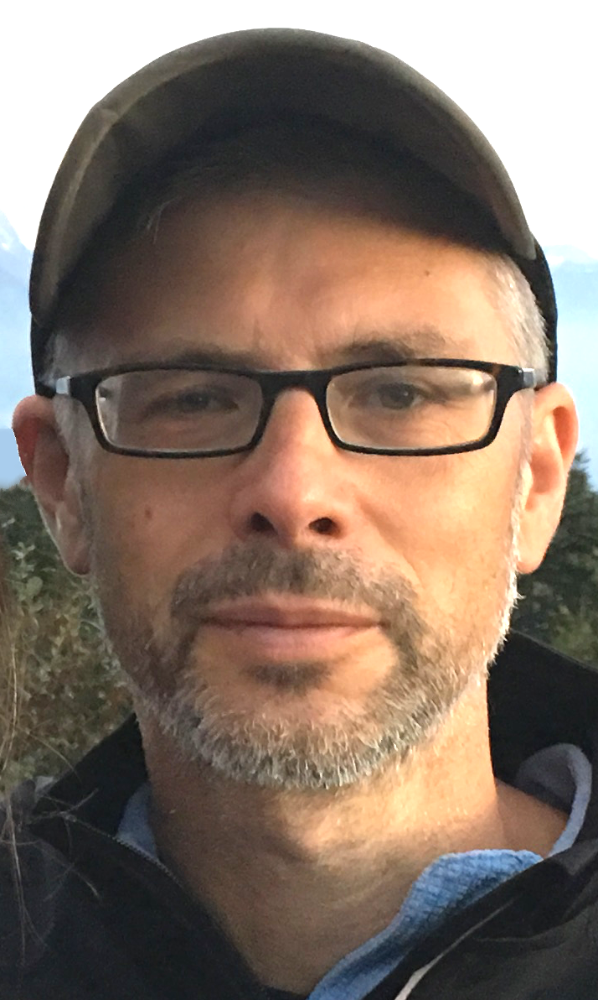

 

# Ethan Weed

Associate Professor, PhD  
Linguistics  
Aarhus University  
Jens Chr. Skous Vej 2, building. 1485  
8000 Aarhus C, Denmark

## Contact

Email: ethan@cc.au.dk  
Homepages  
http://pure.au.dk/portal/en/linew@hum.au.dk  
http://www.ethanweed.com/  
http://cc.au.dk/forskning/forskningscentre/language-as-a-tool-for-learning/

## Education and positions

2015- present: Associate Professor, Linguistics, Aarhus University  
2019: Visiting Researcher, Department of Psychology, University of Connecticut, USA  
2014: Visiting Researcher, Department of Psychology, University of Connecticut, USA  
2011-2014: Assistant Professor, Linguistics, Aarhus University  
2011: Research Assistant at MindLab, Center for Functionally Integrative Neuroscience (CFIN), Aarhus University Hospital  
2011: PhD in Linguistics from Aarhus University (June 8)
2009-2011: PhD fellow Dept. Linguistics, Aarhus University,  
2008: Research assistant at CFIN  
2007: MA in Cognitive Semiotics, Aarhus University  
2003: BA in Spanish from Aarhus University  
1996: BA in Liberal Arts (Major: Ecology) from Hampshire College, USA

## Primary research interests

Clinical Linguistics, Acoustic Phonetics, Clinical Pragmatics, Language Acquisition in Special Populations, Electrophysiological Methods, Natural Language Processing

## Dissertation

PhD Dissertation (2011): Getting the Message Right: Social Cognition, Pragmatic Impairment, and Right Hemisphere Damage

## Courses and workshops attended
2020: Workshop on Online Experiments, Aarhus University
2019: Workshop on Artificial Intelligence: Deep Learning and TensorFlow for Computer Vision and Natural Language Processing, University of Connecticut  
2018: State of Danish Natural Language Processing, Aarhus University    
2018: Advanced Bayesian Statistical Modeling, Interacting Minds Center, Aarhus University  
2013: Graduate Certificate in Tertiary Teaching, Aarhus University  
2012: ERP Bootcamp, Department of Psychology, Copenhagen University  
2007: Wellcome Trust Centre for Neuroimaging SPM course  
2006: Introduction to MATLAB, Center for Functionally Integrative Neuroscience

## Publication Metrics

Peer-reviewed:  
Articles: 13 (first/sole author: 5; last author: 2)  
Refereed posters and abstracts: 27  
Book chapters: 2 (first/sole author: 1; last author: 1)  

Without peer-review:  
Articles and dissemination: 9

Citations: 500 (Google Scholar March 27, 2020)  
H-index: 8 (Google Scholar March 27, 2020)

## Supervision  
##### PhD  
Co-supervisor on three PhD projects 

##### MA  
Supervisor on 31 master theses

## Teaching

#### MA level

Cognitive Neurolinguistics: 2009  
Language of the Brain: 2011  
Psycholinguistics of Second Language Acquisition: 2012  
Language Challenges in the Classroom: 2012  
Statistics for Linguists: 2013  
Development of Language: Language Acquisition: 2013, 2015  
Auditory Neuroscience and Speech Processing: 2014  
Research Workshop: Dyslexia: 2016  
Research Workshop: Auditory Processing: 2017  
Child Language Acquisition: 2016 - 2019

#### BA level

Psycholinguistics: 2009 - 2010  
Humanities Elective Language and Cognition: 2010 - 2014  
Language, Cognition, and the Brain: 2011 - present  
Phonetics and Phonology: 2012, 2015  
Studium Generale (Introduction to Philosophy of Science): 2015  
Text Analysis: 2018

## Dissemination

Over 20 invited talks at e.g. DuPont Nutrition and Health, Novozymes A/S, the Danish Organization of Speech Language Pathologists (FTHF), and Chinese Academy of Sciences

## Management and Administration  
2018 - present: Center Leader, Language as a Tool for Learning Center, AU  
2018 - present: Study Board Representative, Department of Language, Cognitive Science and Semitics, AU  
2018 - present: Study Coordinator, Linguistics  
2018 - 2019: Internship Coordinator, Linguistics

## Research Grants  
2019-2024: Co-Investigator, National Institute on Deafness and Other Communication Disorders: "Early Predictors to School Age Language: Individual and Interactional Child and Parent Factors", Letitia Naigles (PI)  
2018: AU Funding for Language as a Tool for Learning Center
2013-2018: Interacting Minds small grants for projects: “Music, Voice, and Auditory Brainstem Response” “Hearing What You’re Thinking” “Clinical Voices” “How well do cloze tests really test reading comprehension in Danish higher-education students?”  

## Reviewing  
Grant reviewing  
2012: Israel Science Foundation (ISF)  

#### PhD thesis evaluation  
2018: Aymeric Duval-Markussen, Aarhus University (committee chairman)  
2018: Magnus Hamnn, Aarhus University (committee chairman)  
2016: Jens Sand Østergaard, Aarhus University (committee chairman)  

#### Positions  
2015: PhD application committee, Graduate program for Language, Linguistics and Cognition, AU  

#### Reviews for international journals  
Aphasiology 
Dyslexia  
Journal of Child Language  
Journal of Neuroscience  
Proc. Nat. Acad. Sci (PNAS)  
Psychology of Language and Communication  
Journal of Neurolinguistics  
Cognitive Systems Research  
Journal of Psycholinguistic Research

## Peer-reviewed articles 

**Weed, E.**, Fusaroli, R. (2020). Acoustic Measures of Prosody in Right-Hemisphere Damage: A Systematic Review and Meta-Analysis. Journal of Speech, Language, and Hearing Research.

Bønnerup, K., Pedersen, A.L., **Weed, E.**, & Parrila, R. (2019). Differences in the literacy skills of Danish dyslexic students in two types of higher education programs. Dyslexia, 25, 173–189. doi:10.1002/dys.1617  

Fusaroli, R., **Weed, E.**, Fein, D., & Naigles, L. (2018). Hearing me hearing you: Reciprocal effects between child and parent language in autism and typical development. Cognition, 183, 1-18.

Kizach, J., Christensen, K. R., & **Weed, E.** (2016). A verbal illusion: Now in three languages. Journal of psycholinguistic research, 45(3), 753-768.  

Petersen, B., **Weed, E.**, Sandmann, P., Brattico, E., Hansen, M., Sørensen, S. D., & Vuust, P. (2015). Brain responses to musical feature changes in adolescent cochlear implant users. Frontiers in Human Neuroscience, 9, 7.  

Bliksted, V., Fagerlund, B., **Weed, E.**, Frith, C., & Videbech, P. (2014). Social cognition and neurocognitive deficits in first-episode schizophrenia. Schizophrenia Research, 153(1), 9-17.  

**Weed, E.** (2011). What's left to learn about right hemisphere damage and pragmatic impairment?. Aphasiology, 25(8), 872-889.  

**Weed, E.**, McGregor, W., Nielsen, J. F., Roepstorff, A., & Frith, U. (2010). Theory of Mind in adults with right hemisphere damage: What’s the story?. Brain and Language, 113(2), 65-72.  

Tylén, K., **Weed, E.**, Wallentin, M., Roepstorff, A., & Frith, C. D. (2010). Language as a tool for interacting minds. Mind & Language, 25(1), 3-29. 

Tylén, K., Bjørndahl, J. S., & **Weed, E.** (2009). Taking the language stance in a material world: a comprehension study. Pragmatics & Cognition, 17(3), 573-595. 

**Weed, E.** (2008). Theory of mind impairment in right hemisphere damage: A review of the evidence. International Journal of Speech-Language Pathology, 10(6), 414-424.  

Wallentin, M., **Weed, E.**, Østergaard, L., Mouridsen, K., & Roepstorff, A. (2008). Accessing the mental space — spatial working memory processes for language and vision overlap in precuneus. Human Brain Mapping, 29(5), 524-532.  

**Weed, E.** (2008). Looking for Beauty in the Brain. Estetika: The Central European Journal of Aesthetics, 45(1), 5-23.

## Refereed posters and abstracts

Fusaroli, R., **Weed, E.**, Fein, D., Naigles, L. (2020) Intact but Atypical Lexical and Syntactic Alignment in Spontaneous Speech of Children with Autism Spectrum Disorder. MOLA 2020, Durham, North Carolina.

**Weed. E.**, Fusaroli, R., Mayo, J., Eigsti, I-M. (2020) Symptom Severity and Acoustically-Identified Groups of Speakers with and without Autism Spectrum Disorder. MOLA 2020, Durham, North Carolina.

**Weed. E.**, Fusaroli, R., Mayo, J., Eigsti, I-M. (2020) Subgroup Identification of Speakers with and without ASD Using Network Models of Acoustic Features of Prosody and Voice. INSAR 2020, Seattle (Conference canceled).

**Weed. E.**, Fusaroli, R., Mayo, J., Eigsti, I-M. (2020)  Relative Importance of Prosody Versus Voice Quality for Clinician Assessments of Speech in ASD. INSAR 2020, Seattle  (Conference canceled).

Ottosen, H., Bønnerup, K.H., **Weed, E.**, Parrila, R. (2019) Word level problems in Danish students assessed for dyslexia in higher education. CPH 2019 Conference on Literacy.  

Fusaroli, R.; **Weed, E.**; Fein, D.; Naigles, L. (2019) Parental linguistic alignment in conversations with children with ASD and TD children.
Abstract from INSAR 2019, Montreal, Canada.

Fusaroli, R.; **Weed, E.**; Fein, D.; Naigles, L. (2019) Parental linguistic alignment to their children facilitates language acquisition, with syntactic alignment being particularly relevant for children with ASD.
Abstract from INSAR 2019, Montreal, Canada.

**Weed, E.**; Fusaroli, R.; Mayo, J.; Eigsti, I-M. (2019) Creaky Voice in Adolescents with Autism Spectrum Disorder: An Acoustic, Quantitative Analysis.
Abstract from INSAR 2019, Montreal, Canada.

Fusaroli, R., Lambrechts, A., **Weed, E.**, Maras, K., Yarrow, K., Bowler, D., & Gaigg, S. (2017). Social impairment in conversation: disfluency and compensatory mechanisms. In International Meeting for Autism Research.

**Weed, E.**, Fusaroli, R., Tranbjerg, J., Fein, D., & Naigles, L. (2017). Speech turn dynamics in a longitudinal corpus of child-caregiver interactions. In International Meeting for Autism Research

**Weed, E.**, & Fusaroli, R. (2017). No Acoustic Evidence from RHD for a Right Hemisphere Role in Prosody Production: A Meta-Analysis. In The Ninth Annual Meeting of the Society for the Neurobiology of Language.

**Weed, E.**, Fusaroli, R., Fein, D., & Naigles, L. (2015). Longitudinal adaptation in language development: a study of typically-developing children and children with ASD. In 2015 Society for Research in Child Development Biennial Meeting.

Fusaroli, R., **Weed, E.**, & Naigles, L. (2016). Learning to Interact: Developmental Trajectories of Linguistic Alignment in ASD. In International Meeting for Autism Research.

Fusaroli, R., Grossman, R., Cantio, C., Bilenberg, N., & **Weed, E.** (2015). The temporal structure of the autistic voice: a cross-linguistic examination. In International Meeting for Autism Research.

Fusaroli, R., **Weed, E.**, Fein, D., & Naigles, L. (2015). Language development in context: a longitudinal study of typically-developing children and children with ASD. In International Meeting for Autism Research.

Fusaroli, R., Simonsen, A., **Weed, E.**, & Bliksted, V. F. (2014). Non-linear Dynamics of Speech in Schizophrenia: A Machine-Learning Approach. In Schizophrenia International Research Conference.

Fusaroli, R., Cantio, C., Bilenberg, N., & **Weed, E.** (2014). Voice Patterns in Children with Autism Spectrum Disorder: Predicting Diagnostic Status and Symptoms Severity. In the International Meeting for Autism Research 2014.

**Weed, E.** (2014). Sounds in context: electrophysiological evidence for local bias in auditory processing. In Bias in Auditory Perception.

Fusaroli, R., **Weed, E.**, Fein, D., & Naigles, L. (2014). Linguistic adaptation between mothers and children in ASD: a longitudinal perspective. In Psychonomic Society's 55th Annual Meeting.

**Weed, E.**, Kratschmer, A. R., & Pedersen, M. N. (2014). Testing the validity of wireless EEG for cognitive research with auditory and visual paradigms. In SNL 2014-Society for the Neurobiology of Language.

Fusaroli, R., Bang, D., & **Weed, E.** (2013). Non-linear analyses of speech and prosody in asperger’s syndrome. In International Meeting For Autism Research.

Fusaroli, R., Tylén, K., Simonsen, A., & **Weed, E.** (2013). Non-linear dynamics of voice in mental disorders. Cog Sci.

Petersen, B., **Weed, E.**, Hansen, M., Derdau, S., Sandmann, P., & Vuust, P. (2013). Brain Responses to Language-relevant Musical Features in Adolescent Cochlear Implant Users Before and After an Intensive Music Training Program. Interaction. In Neurobiology of Language Conference

**Weed, E.**, & Fusaroli, R. (2013). Prosodic production in right-hemisphere stroke patients: using temporal dynamics to characterize voice quality. In Neurobiology of Language.

**Weed, E.**, Allen, M. G., & Gramm, D. (2012). Negative “gossip” stimuli modulate left-lateralized P1 component while viewing neutral faces. In Neurobiology of Language

**Weed, E.**, & Christensen, P. (2011). Cross-modal integration of affective facial expression and vocal prosody: an EEG study. In The 3rd Conference of the Scandinavian Association for Language and Cognition.

**Weed, E.**, McGregor, W., Feldbaek, J., & Roepstroff, A. (2009). Moving pictures: Using descriptions of animations to assess Theory of Mind in people with right-hemisphere damage. In La lingüística ante el reto de la aplicación clínica: actas del II Congreso Internacional de Lingüística Clínica (pp. 247-249). Universidad Nacional de Educación a Distancia, UNED.

## Book chapters  
**Weed, E.** (2013). Is there an irony center in the brain?. In Ironistik (pp. 79-83). Publizon.

Tylén, K., Bjørndahl, J. S., & **Weed, E.** (2011). Actualizing semiotic affordances in a material world. Benjamins Current Topics, 81.

## Publications without peer-review

Sørensen, L. L., Claumarch, I. E. R., & **Weed, E.** (2017). Testning af alment ordforråd hos danske universitetsstuderende: et normeringsstudie. Dansk Audiologopaedi, 53(1), 10-15.

**Weed, E.**, & Fusaroli, R. (2015). Modeling parent-child dyads in the linguistic development of children with and without ASD. In Autism@Aarhus 2015 Symposium: 4Th Anniversary Meeting.

**Weed, E.**, Kratschmer, A. R., Lieberoth, A., & Pedersen, M. N. (2014). Wireless EEG for field study: Checking the data quality.

Zareini, B., Nielsen, J. F., Kock-Jensen, C., Vuust, P., **Weed, E.**, Pedersen, M. N., & Overgaard, M. (2013). Cognitive Complexity and Disorders of Consciousness.

**Weed, E.** (2013). A Review of Palmer, SE and Shimamura, AP eds., Aesthetic Science. Estetika, 6(1), 128-133.

**Weed, E.** (2009). Når ”Godt gået” betyder ”dumt gjort”. Logos: Audiologopædisk Tidsskrift, (57), 12-13.

**Weed, E.** (2004). A Labyrinth Of Symbols Exploring ‘The Garden Of Forking Paths’. Variaciones Borges, 18, 161-189.

**Weed, E.** (2004). Aspectos De La Citación En “Tlön, Uqbar, Orbis Tertius”. Variaciones Borges, 17, 21-42.

**Weed, E.** (2007). Bits and pieces: perception, cognition, and language in patients with damage to the right cerebral hemisphere. In Language in cognition, cognition in language, Aarhus University

## Monographs  
**Weed, E.** (2011). Getting the Message Right: Social Cognition, Pragmatic Impairment, and Right Hemisphere Damage (Doctoral dissertation, Aarhus Universitet).