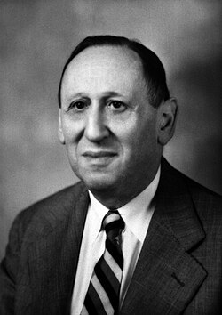
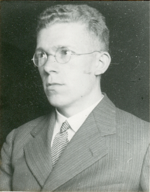

# Autism

---

## Leo Kanner

:::::: {.two-col}

::: {}

:::

::: {}
8 boys and 3 girls

Two essential features:

1. severe problems in social interaction and connectedness from the beginning of life
2. resistance to change or insistence on sameness.
:::

::::::

---

## Leo Kanner

:::::: {.two-col}

::: {}

:::

::: {}
Also: **language** features such as 

- echolalia
- pronoun reversal
- unusual prosody
:::

::::::

---

## Hans Asperger

:::::: {.two-col}

::: {}

:::

::: {}
Described boys with marked social difficulties, unusual and particular interests, and **good verbal skills** 
:::

::::::

---

## Formal diagnosis 

DSM-III (1980) 

- Introduces three domains:

1. qualitative impairments in reciprocal social interaction
2. impairments in **communication**,
3. restricted interests/resistance to change and repetitive movements.

---

## Formal diagnosis

DSM-IV (1994)

- Sticks with the main three domains
- Many subcategories of Pervasive Developmental Disorders:
    - autistic disorder
    - Asperger’s disorder
    - Rett’s disorder
    - childhood disintegrative disorder
    - Pervasive Developmental Disorder not otherwise specified (PDD-NOS)

---

## Formal diagnosis

Problems with the DSM-IV

1. too much overlap betwen subcategories
2. hard to know which subcategory to diagnose
3. poor predictive power on later outcomes
4. restrictions on treatment eligibility based on subtcategory

---

## Formal diagnosis

DSM-V (2013): A more dimensional approach - subtypes are out

![[@lordAnnualResearchReview2012]](images/Lord_Jones_2012.png){height=400px} 

---

## Dimensions and categories

![[@rosenDiagnosisAutismKanner2021]](images/Rosen_etal_2021.png){height=400px}

---

## Prevalance

- 1970: 3 in 10,000 children (Treffert 1970) [.3 in 1000 children]
- 1999: 7 in 10,000 children (Fombonne 1999) [.7 in 1000 children]

---

## Prevalance

![[@chiarottiEpidemiologyAutismSpectrum2020]](images/Chiarottie_Venerosi_2020_1.png){height=400px}

---

## Prevalance

![[@chiarottiEpidemiologyAutismSpectrum2020]](images/Chiarottie_Venerosi_2020_2.png){height=400px}

---

## Prevalance

![[@jensendelopezPrevalenceAutismScandinavian2024]](images/Jensen_de_Lopez_Møller_2024.png){height=400px}

---

## Research Interest

![[@rongBibliometricsAnalysisVisualization2022]](images/Rong_et_al_2022.png){height=400px}

---

# Language

---

![[@ballyCourseGeneralLinguistics]](images/Saussure_01.png)

---

![[@ballyCourseGeneralLinguistics]](images/Saussure_07.png)

---

- semantics
- morphology and syntax
- pragmatics (including prosody)

---

## Prosody 🎶

:::::: {.two-col}

::: {}
Three types of prosodic feature:

1. pitch
1. rhythm
1. timbre

:::

::: {}
Two types of acoustic feature:

1. source features (e.g. pitch, jitter)
2. temporal features (pauses, articulation rate, etc.)

:::

::::::

---

# Autism and Language

---

## Discourse

:::::: {.two-col}

::: {}
![[@baltaxePragmaticDeficitsLanguage1977b]](images/Baltaxe_1977a.png)
:::

::: {}
![[@baltaxePragmaticDeficitsLanguage1977b]](images/Baltaxe_1977b.png)
:::

::::::

---

## Atypical prosody

![[@baltaxeSimmonsProsodicDevelopment1985]](images/Baltaxe_Simmons_1985.png){height=400px}

---

## Re-introducing context

![[@Vorletcontext]](images/Vorlet-context.jpg)

---

## Discourse in context

:::::: {.two-col}

::: {}

![[@jonesItsImportantFrequency2022]](images/Jones_etal_2022.png)

:::

::: {}

![[@schillingerQuickHelloExploring]](images/Schillinger%20et%20al_2026.png)

:::

::::::

---

## Normal but different

:::::: {.two-col}

::: {}
![[@zaneNormalDifferentAutistic2024]](images/Zane_Grossman_eggs_2024_1.png)
:::

::: {}
![[@zaneNormalDifferentAutistic2024]](images/Zane_Grossman_eggs_2024_2.png)
:::

::::::

---

## Prosody in context

:::::: {.two-col}

::: {}
![[@weedDifferentDifferentWays2023]](images/Weed_etal_2023.png)
:::

::: {}
![[@liuRethinkingProsodyProduction2026]](images/Liu_etal_2026.png)
:::

::::::

---

## Prosody in context

![[@weedPerceptualConsensusNeurotypes2026]](images/Weed_etal_2026_1.png)

---

## Prosody in context

:::::: {.two-col}

::: {}
![[@weedPerceptualConsensusNeurotypes2026]](images/Weed_etal_2026_2.png)
:::

::: {}
![[@weedPerceptualConsensusNeurotypes2026]](images/Weed_etal_2026_3.png)
:::

::::::

---

# References

## References {.scrollable}

::: {#refs}
:::

